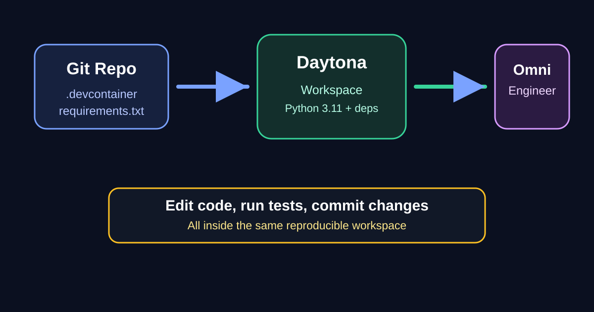

# Run Omni Engineer Inside Daytona

AI coding assistants are most useful when they can inspect a real repository, install its dependencies, and make changes in an environment that looks like the one a developer will actually use.

Running them directly on a laptop works, but it also creates familiar problems: dependency drift, secret handling mistakes, missing packages, and setup instructions that only work for the last person who touched the project.

Daytona solves that by turning a repository into a repeatable workspace. In this guide, we will add a [Dev Container](/definitions/20260512_definition_dev_container.md) configuration to Omni Engineer and Claude Engineer.

Then we will create a Daytona workspace from the configured repository and use Omni Engineer on a concrete coding task.

The workflow is intentionally simple: the repository owns the environment, Daytona creates the workspace, and the AI engineer runs inside that workspace instead of on an untracked local machine.



## TL;DR

- Add `.devcontainer/devcontainer.json` to the AI engineer repository.
- Let Daytona create a workspace from the repository so dependencies install automatically.
- Put API keys in `.env` inside the workspace, not in Git.
- Run Omni Engineer with `python main.py` and use it against files in the workspace.
- The same pattern works for Claude Engineer, including its web interface on port `5000`.

## What We Are Building

The goal is a workspace that a developer can open and use without manual Python setup. The Dev Container file defines the base image, Python version, post-create install command, editor extensions, and forwarded ports. Daytona reads that configuration and creates a development environment from it.

For Omni Engineer, the workspace needs Python, the packages in `requirements.txt`, Git, and an `.env` file where the developer can add `OPENROUTER_API_KEY`. Omni Engineer uses OpenRouter through the OpenAI-compatible client, so the key should be provided at runtime rather than committed.

For Claude Engineer, the workspace needs the packages in `requirements.txt`, an `.env` file for `ANTHROPIC_API_KEY`, and port `5000` forwarded when the developer chooses to run the Flask web interface.

Two upstream pull requests add these Dev Container configurations:

- [Omni Engineer Dev Container PR](https://github.com/Doriandarko/omni-engineer/pull/29)
- [Claude Engineer Dev Container PR](https://github.com/Doriandarko/claude-engineer/pull/253)

Those pull requests are intentionally small. They do not change model behavior, prompts, or application logic. They only make each repository easier to launch in Daytona and other Dev Container-compatible tools.

## Add a Dev Container to Omni Engineer

Create a `.devcontainer` directory in the Omni Engineer repository and add this file as `.devcontainer/devcontainer.json`:

```json
{
  "name": "Omni Engineer",
  "image": "mcr.microsoft.com/devcontainers/python:1-3.11-bullseye",
  "features": {
    "ghcr.io/devcontainers/features/git:1": {}
  },
  "postCreateCommand": "python -m pip install --upgrade pip && pip install -r requirements.txt && cp -n .env.example .env || true",
  "customizations": {
    "vscode": {
      "extensions": [
        "ms-python.python",
        "ms-python.vscode-pylance"
      ],
      "settings": {
        "python.defaultInterpreterPath": "/usr/local/bin/python"
      }
    }
  },
  "remoteEnv": {
    "PYTHONUNBUFFERED": "1"
  }
}
```

The important line is `postCreateCommand`. After Daytona creates the workspace, it upgrades `pip`, installs the Python dependencies, and creates `.env` from `.env.example` if a developer has not already created one.

The `cp -n` flag avoids overwriting an existing `.env` file, which is important because `.env` is where the developer adds their private key.

The README should also explain the Daytona path:

```bash
git clone https://github.com/doriandarko/omni-engineer.git
cd omni-engineer
# Daytona reads .devcontainer/devcontainer.json when creating the workspace.
python main.py
```

Before opening a pull request, validate that the file is valid JSON and that the Python files still compile:

```bash
python3 -m json.tool .devcontainer/devcontainer.json >/dev/null
git diff --check
find . -maxdepth 2 -name '*.py' -not -path './.git/*' -print0 | \
  xargs -0 python3 -m py_compile
python3 -m venv .venv-check
. .venv-check/bin/activate
pip install -r requirements.txt
deactivate
rm -rf .venv-check
```

That validation does not call the OpenRouter API. It only checks that the workspace definition is syntactically valid and that the dependency set can install cleanly in a fresh Python environment.

## Add a Dev Container to Claude Engineer

Claude Engineer has both a CLI and a web interface, so its Dev Container includes port forwarding for the Flask app:

```json
{
  "name": "Claude Engineer",
  "image": "mcr.microsoft.com/devcontainers/python:1-3.11-bullseye",
  "features": {
    "ghcr.io/devcontainers/features/git:1": {}
  },
  "postCreateCommand": "python -m pip install --upgrade pip && pip install -r requirements.txt && cp -n .env.example .env || true",
  "forwardPorts": [5000],
  "portsAttributes": {
    "5000": {
      "label": "Claude Engineer Web UI",
      "onAutoForward": "notify"
    }
  },
  "customizations": {
    "vscode": {
      "extensions": [
        "ms-python.python",
        "ms-python.vscode-pylance"
      ],
      "settings": {
        "python.defaultInterpreterPath": "/usr/local/bin/python"
      }
    }
  },
  "remoteEnv": {
    "PYTHONUNBUFFERED": "1",
    "FLASK_RUN_HOST": "0.0.0.0"
  }
}
```

The same validation commands apply. For Claude Engineer, the environment file should contain `ANTHROPIC_API_KEY`, and `E2B_API_KEY` is optional depending on which tools the developer wants to use.

Once the workspace is created, the developer can choose either interface:

```bash
python ce3.py
```

or:

```bash
python app.py
```

When the web interface starts, Daytona exposes the forwarded `5000` port so the developer can open the application in a browser without manually configuring tunnels.

## Create the Daytona Workspace

After the Dev Container pull request is merged, creating a Daytona workspace is straightforward. From the Daytona dashboard, choose the Git provider, select the repository, and create the workspace.

Daytona detects `.devcontainer/devcontainer.json` and builds the development environment from the repository.

If you prefer the CLI, the workflow is the same conceptually: authenticate with Daytona, create a workspace from the Git repository, and open it. The exact command names can change across Daytona CLI releases, so use the installed CLI help as the source of truth:

```bash
daytona --help
daytona create --help
```

A typical workspace creation flow looks like this:

```bash
daytona create https://github.com/Doriandarko/omni-engineer
daytona open omni-engineer
```

Use the fork URL while testing a pull request:

```bash
daytona create https://github.com/jswagbo/omni-engineer/tree/add-daytona-devcontainer
```

Then open a terminal in the workspace and add your API key:

```bash
cp -n .env.example .env
printf 'OPENROUTER_API_KEY="your_openrouter_key"\n' > .env
```

Do not commit `.env`. The repository should keep `.env.example` as documentation and keep real secrets in the workspace environment only.

## Use Omni Engineer on a Specific Example

For a concrete example, create a tiny Python utility inside the Daytona workspace and ask Omni Engineer to improve it. Start with this file:

```bash
cat > slugify.py <<'PY'
def slugify(text):
    return text.lower().replace(" ", "-")
PY
```

Run Omni Engineer:

```bash
python main.py
```

Inside the Omni Engineer console, add the file to context:

```text
/add slugify.py
```

Then ask for a focused change:

```text
Please make slugify.py handle repeated whitespace, punctuation, and leading or trailing dashes. Keep the implementation dependency-free and add a short explanation of the edge cases.
```

Omni Engineer can inspect the file and propose an implementation. A reasonable result is:

```python
import re


def slugify(text):
    cleaned = re.sub(r"[^a-z0-9]+", "-", text.lower())
    return cleaned.strip("-")
```

Now add a small test file:

```bash
cat > test_slugify.py <<'PY'
from slugify import slugify


def test_slugify_normalizes_text():
    assert slugify(" Hello, Daytona + Omni Engineer! ") == "hello-daytona-omni-engineer"


def test_slugify_collapses_repeated_separators():
    assert slugify("One   two___three") == "one-two-three"
PY
python -m pip install pytest
pytest -q
```

This example is deliberately small, but it proves the important workflow. The AI engineer runs in the Daytona workspace, reads and edits files in the repository, and the developer validates the result in the same environment.

For a larger task, use the same loop: add the relevant files with `/add`, ask for a narrow change, inspect the diff, and run the project tests before committing.

## Contribution Checklist

Use this checklist before submitting the Dev Container contribution:

- The Dev Container file is committed at `.devcontainer/devcontainer.json`.
- The container installs dependencies from the repository's existing dependency file.
- API keys are read from `.env` and are never committed.
- The README explains how to use Daytona.
- JSON validation passes.
- `git diff --check` passes.
- Python compilation or the repository's normal test command passes.
- The pull request describes exactly what was validated.

This keeps the contribution honest. A Dev Container PR should not claim that model calls were tested unless the contributor actually supplied keys and ran model calls.

It is enough to show that the workspace builds, dependencies install, and the documented command starts from the configured environment.

## Troubleshooting

If `python main.py` fails because `OPENROUTER_API_KEY` is missing, open `.env` and add the key. If the file does not exist, copy `.env.example` first.

If Daytona creates the workspace but dependencies are missing, reopen the workspace terminal and run the same command from `postCreateCommand` manually:

```bash
python -m pip install --upgrade pip
pip install -r requirements.txt
```

If Claude Engineer's web UI starts but the browser cannot connect, confirm that the app is listening on `0.0.0.0` and that Daytona forwarded port `5000`. The Dev Container sets `FLASK_RUN_HOST=0.0.0.0` and declares `forwardPorts`, but application code or framework defaults can still matter.

## Conclusion

Daytona and Dev Containers make AI engineer projects easier to try because setup becomes part of the repository. Instead of asking every developer to recreate a Python environment by hand, the project declares the environment once and Daytona builds it on demand.

For Omni Engineer, that means a developer can create a workspace, add `OPENROUTER_API_KEY`, and run `python main.py`. For Claude Engineer, the same pattern supports both `python ce3.py` and the Flask web interface on port `5000`.

The practical payoff is a cleaner contribution loop: define the workspace, run the AI engineer inside it, make a specific change, validate the result, and submit a pull request with a reproducible setup.

## References

- [Omni Engineer](https://github.com/Doriandarko/omni-engineer)
- [Claude Engineer](https://github.com/Doriandarko/claude-engineer)
- [Daytona](https://www.daytona.io)
- [Development Containers specification](https://containers.dev)
- [Omni Engineer Dev Container pull request](https://github.com/Doriandarko/omni-engineer/pull/29)
- [Claude Engineer Dev Container pull request](https://github.com/Doriandarko/claude-engineer/pull/253)
