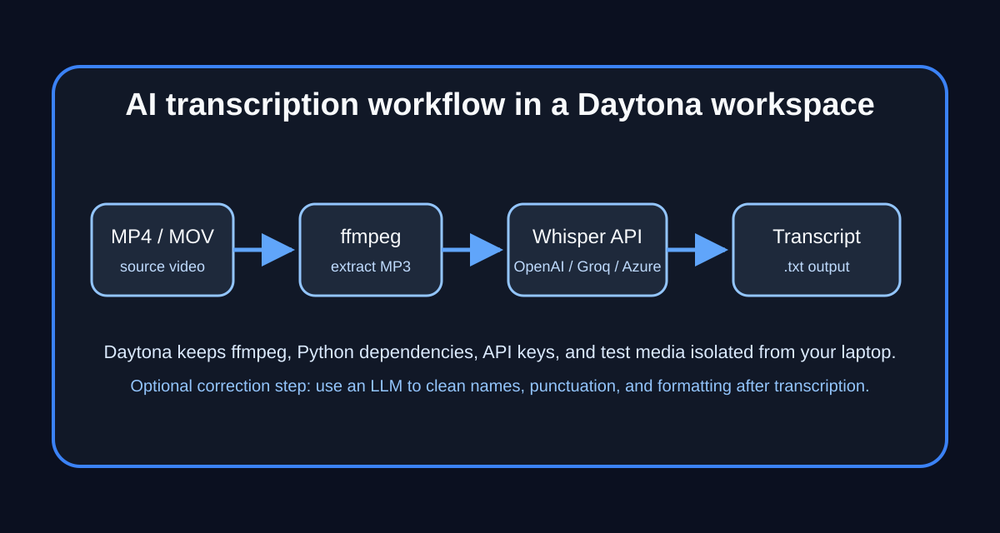

# Build an AI transcription tool in Daytona

# Introduction

Video is useful, but text is easier to search, summarize, translate, and share. That is why [AI
transcription](../definitions/20260512_definition_ai_transcription.md) has become a standard
building block for developer relations teams, support teams, researchers, and anyone who works with
recorded demos, interviews, lectures, podcasts, or meetings. The usual workflow is simple in
concept: extract the audio from a video, send it to a speech-to-text model, and save the transcript.
The messy part is making that workflow repeatable across machines.

This guide shows how to run a Python transcription project inside a Daytona workspace using
[Sapat](https://github.com/nkkko/sapat), an open-source command-line tool that supports OpenAI,
Groq, and Azure OpenAI transcription APIs. You will create a reproducible development environment,
configure API credentials safely, transcribe a sample video, and understand how to extend the same
pattern to other providers such as Deepgram or AssemblyAI.



## TL;DR

- Sapat converts video files to MP3 with `ffmpeg`, sends the audio to a transcription provider, and writes a `.txt` transcript next to the source file.
- Daytona gives the project a clean workspace so Python dependencies, `ffmpeg`, and local media files do not pollute your laptop.
- The same command can target OpenAI, Groq, or Azure OpenAI by switching the `--api` flag and environment variables.
- Prompt hints, language selection, and audio quality settings make transcripts more accurate for technical content.
- Provider adapters are isolated in `src/sapat/transcription`, so adding another API is straightforward.

## Prerequisites

Before you start, make sure you have:

- A Daytona account and the Daytona CLI installed.
- Git installed locally.
- An API key for at least one supported transcription provider: OpenAI, Groq, or Azure OpenAI.
- A short `.mp4` test video. A screen recording or product demo is perfect.
- Basic familiarity with Python virtual environments and command-line tools.

The examples below use Groq because it is fast and simple to configure, but the same workflow works with OpenAI or Azure OpenAI.

## Step 1: Create a Daytona workspace from Sapat

Start by creating a workspace directly from the Sapat repository:

```bash
daytona create https://github.com/nkkko/sapat --code
```

Daytona opens the project in your editor with a dedicated development environment. This is useful
for transcription projects because media tooling often depends on native packages. Instead of asking
every contributor to install the same Python version, `ffmpeg`, build tooling, and editor extensions
manually, the workspace becomes the shared source of truth.

If you prefer to fork first, clone your fork into Daytona instead:

```bash
gh repo fork nkkko/sapat --clone
cd sapat
daytona create . --code
```

Use a fork when you plan to change the tool itself. Use the upstream repository directly when you only want to run it.

## Step 2: Inspect the project structure

Inside the workspace, the most important files are:

```text
sapat/
├── README.md
├── requirements.txt
├── pyproject.toml
├── .env.example
└── src/sapat/
    ├── script.py
    └── transcription/
        ├── base.py
        ├── openai.py
        ├── groq.py
        └── azure.py
```

The CLI entry point lives in `src/sapat/script.py`. It accepts a file or directory path, chooses a
transcription provider with `--api`, and passes the work to a provider class. The shared workflow
lives in `src/sapat/transcription/base.py`: convert the input video to MP3, call the
provider-specific `transcribe_audio` method, write the returned transcript to a `.txt` file, and
delete the temporary MP3.

That separation is the main design advantage. The CLI does not need to know provider-specific HTTP details. Each API adapter only needs to implement the same interface.

## Step 3: Install dependencies in the workspace

Create and activate a virtual environment:

```bash
python -m venv .venv
source .venv/bin/activate
```

Install the project dependencies:

```bash
pip install -r requirements.txt
```

Sapat also depends on `ffmpeg` for audio extraction. Check whether it is available in your workspace:

```bash
ffmpeg -version
```

If the command is missing, install it in the workspace. On Debian-based containers, use:

```bash
sudo apt-get update
sudo apt-get install -y ffmpeg
```

For a long-lived team project, add that package installation to the dev container configuration so every Daytona workspace starts with the same tools.

## Step 4: Configure provider credentials

Copy the example environment file:

```bash
cp .env.example .env
```

Then add the credentials for the provider you want to use. For Groq, the minimum useful configuration is:

```bash
GROQCLOUD_API_KEY=your_groq_key_here
GROQCLOUD_MODEL=whisper-large-v3-turbo
GROQCLOUD_API_ENDPOINT=https://api.groq.com/openai/v1/audio/transcriptions
GROQCLOUD_MODEL_NAME_CHAT=llama3-8b-8192
```

For OpenAI, use:

```bash
OPENAI_API_KEY=your_openai_key_here
OPENAI_MODEL=whisper-1
OPENAI_API_ENDPOINT=https://api.openai.com/v1/audio/transcriptions
OPENAI_MODEL_NAME_CHAT=gpt-4o
```

For Azure OpenAI, use your deployment-specific endpoint and deployment names:

```bash
AZURE_OPENAI_API_KEY=your_azure_key_here
AZURE_OPENAI_ENDPOINT=https://your-resource.openai.azure.com
AZURE_OPENAI_DEPLOYMENT_NAME_WHISPER=whisper
AZURE_OPENAI_API_VERSION_WHISPER=2024-06-01
AZURE_OPENAI_DEPLOYMENT_NAME_CHAT=gpt-4o
AZURE_OPENAI_API_VERSION_CHAT=2023-03-15-preview
```

Do not commit `.env`. Keep real keys in Daytona workspace secrets, local environment variables, or another secure secret manager.

## Step 5: Install the CLI locally

You can run the package from source during development:

```bash
pip install -e .
```

Confirm that the command is available:

```bash
sapat --help
```

You should see options for `--language`, `--prompt`, `--temperature`, `--quality`, `--correct`, and `--api`.

## Step 6: Transcribe a single video

Put a short test file in the project, for example:

```text
samples/product-demo.mp4
```

Run Sapat with Groq:

```bash
sapat samples/product-demo.mp4 \
  --api groq \
  --quality H \
  --language en \
  --prompt "Product demo with Daytona, dev containers, and AI transcription"
```

The command performs four steps:

1. Converts `product-demo.mp4` to `product-demo.mp3` with `ffmpeg`.
2. Sends the MP3 file to the selected transcription API.
3. Writes the transcript to `samples/product-demo.txt`.
4. Deletes the temporary MP3 file.

Open the generated text file:

```bash
cat samples/product-demo.txt
```

If you recorded a screen demo, the result should be good enough to search and edit. For a polished article, tutorial, or support knowledge base, plan to review the transcript manually before publishing.

## Step 7: Transcribe a folder of videos

Sapat can process every `.mp4` file in a directory:

```bash
sapat samples/ \
  --api openai \
  --quality M \
  --language en
```

This is useful when converting a batch of tutorials or meeting recordings. Each source file gets a transcript with the same base name:

```text
samples/demo-1.mp4 -> samples/demo-1.txt
samples/demo-2.mp4 -> samples/demo-2.txt
samples/demo-3.mp4 -> samples/demo-3.txt
```

For large batches, start with a small subset first. Transcription APIs usually charge by audio duration, and long videos may hit upload or request limits.

## Step 8: Improve accuracy with prompts and quality settings

Transcription models often struggle with product names, acronyms, and proper nouns. The `--prompt` option gives the provider context before transcription:

```bash
sapat samples/team-demo.mp4 \
  --api groq \
  --prompt "Names and terms: Daytona, devcontainer.json, OpenAI Whisper, Groq, Azure OpenAI, Sapat" \
  --language en
```

Use prompts for:

- Product names: Daytona, Sapat, Groq, OpenAI.
- Technical terms: dev container, workspace, API endpoint, transcript.
- Speaker names and company names.
- Domain-specific vocabulary.

The `--quality` flag controls the temporary MP3 output:

| Quality | Audio settings | Best for |
| --- | --- | --- |
| `L` | 22.05 kHz mono, 96 kbps | quick tests and small files |
| `M` | 44.1 kHz mono, 96 kbps | normal spoken-word videos |
| `H` | 44.1 kHz stereo, 192 kbps | noisy audio or higher-quality archives |

Higher quality can improve recognition for difficult audio, but it also creates larger temporary files. For most voice recordings, `M` is a good default.

## Step 9: Use the correction pass carefully

Sapat includes a `--correct` flag that can run a language model pass after transcription. The goal is not to rewrite the speaker. The goal is to fix punctuation, casing, and predictable spelling errors.

Run it like this:

```bash
sapat samples/interview.mp4 \
  --api openai \
  --correct \
  --prompt "Names: Daytona, Sapat, Whisper, devcontainer.json, Groq"
```

Use correction when the transcript is going into a blog post, internal documentation, or a support article. Skip correction when legal, research, or compliance use cases require a more literal transcript. In those cases, keep the raw model output and edit a separate copy.

## Step 10: Add another transcription provider

The repository already separates each provider into its own class. To add a provider such as Deepgram, AssemblyAI, or Replicate, follow the same pattern.

Create a new file:

```text
src/sapat/transcription/deepgram.py
```

Implement the adapter:

```python
import os
import requests
from .base import TranscriptionBase


class DeepgramTranscription(TranscriptionBase):
    def transcribe_audio(self, audio_file: str, **kwargs):
        api_key = os.environ["DEEPGRAM_API_KEY"]
        language = kwargs.get("language", "en")

        with open(audio_file, "rb") as audio:
            response = requests.post(
                "https://api.deepgram.com/v1/listen",
                params={"model": "nova-2", "language": language},
                headers={
                    "Authorization": f"Token {api_key}",
                    "Content-Type": "audio/mpeg",
                },
                data=audio,
                timeout=120,
            )

        response.raise_for_status()
        data = response.json()
        return data["results"]["channels"][0]["alternatives"][0]["transcript"]
```

Then update `src/sapat/script.py` so the CLI accepts the new provider:

```python
from .transcription.deepgram import DeepgramTranscription

@click.option(
    "--api",
    "-a",
    type=click.Choice(["openai", "groq", "azure", "deepgram"], case_sensitive=True),
    required=True,
    help="API to use for transcription",
)
```

And add a branch in the provider selection logic:

```python
elif api.lower() == "deepgram":
    transcriber = DeepgramTranscription(temperature=temperature)
```

Finally, document the required environment variables in `.env.example`:

```bash
DEEPGRAM_API_KEY=your_deepgram_key_here
```

This approach keeps the CLI stable while making providers interchangeable.

## Step 11: Make the workflow reproducible with a dev container

If you plan to share the project with a team, commit a `.devcontainer/devcontainer.json` file that installs Python and `ffmpeg` automatically:

```json
{
  "name": "sapat-transcription",
  "image": "mcr.microsoft.com/devcontainers/python:3.11-bullseye",
  "features": {},
  "postCreateCommand": "sudo apt-get update && sudo apt-get install -y ffmpeg && pip install -r requirements.txt && pip install -e .",
  "customizations": {
    "vscode": {
      "extensions": [
        "ms-python.python",
        "ms-python.vscode-pylance"
      ]
    }
  }
}
```

Now every Daytona workspace created from the repository starts with the same runtime. This is especially helpful for content teams that want repeatable demos and for engineering teams that want contributors to reproduce transcription bugs quickly.

## Troubleshooting

**Problem:** `ffmpeg: command not found`

**Solution:** Install `ffmpeg` in the workspace and add it to your dev container setup so the fix persists.

**Problem:** The CLI cannot find `sapat`.

**Solution:** Activate your virtual environment and run `pip install -e .` from the project root.

**Problem:** The API returns an authentication error.

**Solution:** Check that the correct environment variable is set for the provider selected by `--api`. For example, `--api groq` needs `GROQCLOUD_API_KEY`.

**Problem:** The transcript has product names spelled incorrectly.

**Solution:** Use the `--prompt` flag with the correct spellings of names, products, acronyms, and technical terms.

**Problem:** A long video fails during upload.

**Solution:** Split the video into smaller chunks or lower the temporary MP3 quality. Provider upload limits vary, so check the selected API's documentation.

## Conclusion

You now have a reproducible AI transcription workflow running inside Daytona. Sapat handles the
practical steps: extracting audio with `ffmpeg`, calling OpenAI, Groq, or Azure OpenAI, and writing
transcripts to text files. Daytona keeps the environment clean and repeatable so the workflow can be
shared with teammates or used as the foundation for a larger content pipeline.

The next step is to adapt the provider layer to your team's needs. If you need cheaper batch
transcription, add another provider adapter. If you need publication-ready transcripts, add a review
or correction step. If you need scale, wrap the CLI in a job queue. The architecture is small enough
to understand quickly, but flexible enough to grow into a production workflow.

## References

- [Sapat GitHub repository](https://github.com/nkkko/sapat)
- [Daytona documentation](https://www.daytona.io/docs/)
- [OpenAI audio transcription documentation](https://platform.openai.com/docs/guides/speech-to-text)
- [Groq speech-to-text documentation](https://console.groq.com/docs/speech-to-text)
- [Azure OpenAI Whisper documentation](https://learn.microsoft.com/azure/ai-services/openai/whisper-quickstart)
- [FFmpeg documentation](https://ffmpeg.org/documentation.html)
